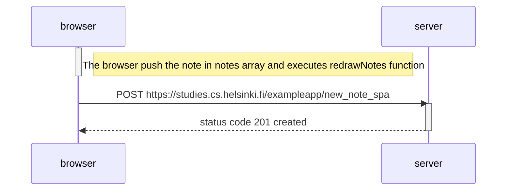

```mermaid
sequenceDiagram
    participant browser
    participant server

    activate browser
    Note right of browser: The browser push the note in notes array and executes redrawNotes function
    deactivate browser

    browser->>server: POST https://studies.cs.helsinki.fi/exampleapp/new_note_spa
    activate server
    server-->>browser: status code 201 created
    deactivate server

```