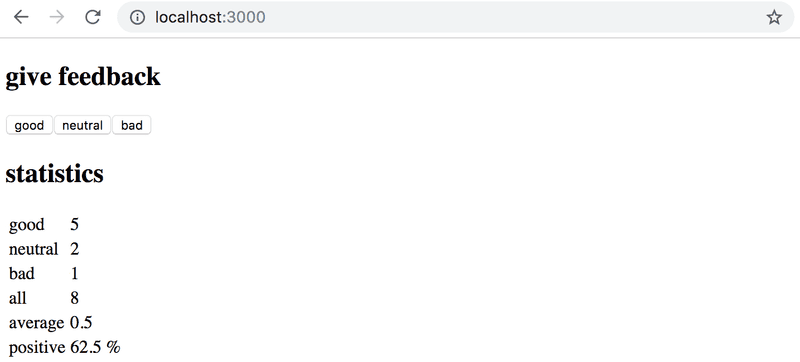
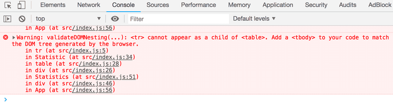

# Unicafe

See original steps 1 and 2 [here](https://fullstackopen.com/en/part1/a_more_complex_state_debugging_react_apps#exercises-1-6-1-14).

## Step 1

Like most companies, the student restaurant of the University of Helsinki Unicafe collects feedback from its customers. Your task is to implement a web application for collecting customer feedback. There are only three options for feedback: good, neutral, and bad.

Note that your application needs to work only during a single browser session. Once you refresh the page, the collected feedback is allowed to disappear.

It is advisable to use the same structure that is used in the material and previous exercise. File main.jsx is as follows:
```js
import React from 'react'
import ReactDOM from 'react-dom/client'

import App from './App'

ReactDOM.createRoot(document.getElementById('root')).render(<App />)
```
You can use the code below as a starting point for the App.jsx file:
```js
import { useState } from 'react'

const App = () => {
  // save clicks of each button to its own state
  const [good, setGood] = useState(0)
  const [neutral, setNeutral] = useState(0)
  const [bad, setBad] = useState(0)

  return (
    <div>
      code here
    </div>
  )
}

export default App
```

## Step 2

Expand your application so that it shows more statistics about the gathered feedback: the total number of collected feedback, the average score (good: 1, neutral: 0, bad: -1) and the percentage of positive feedback.

## Step 3

Refactor your application so that displaying the statistics is extracted into its own Statistics component. The state of the application should remain in the App root component.

Remember that components should not be defined inside other components:
```js
// a proper place to define a component
const Statistics = (props) => {
  // ...
}

const App = () => {
  const [good, setGood] = useState(0)
  const [neutral, setNeutral] = useState(0)
  const [bad, setBad] = useState(0)

  // do not define a component within another component
  const Statistics = (props) => {
    // ...
  }

  return (
    // ...
  )
}
```

## Step 4

Change your application to display statistics only once feedback has been gathered.

## Step 5

Let's continue refactoring the application. Extract the following two components:

Button handles the functionality of each feedback submission button.
StatisticLine for displaying a single statistic, e.g. the average score.
To be clear: the StatisticLine component always displays a single statistic, meaning that the application uses multiple components for rendering all of the statistics:
```js
const Statistics = (props) => {
  /// ...
  return(
    <div>
      <StatisticLine text="good" value ={...} />
      <StatisticLine text="neutral" value ={...} />
      <StatisticLine text="bad" value ={...} />
      // ...
    </div>
  )
}copy
The application's state should still be kept in the root App component.
```

## Step 6

Display the statistics in an HTML table, so that your application looks roughly like this:

screenshot of statistics table
Remember to keep your console open at all times. If you see this warning in your console:

console warning
Then perform the necessary actions to make the warning disappear. Try pasting the error message into a search engine if you get stuck.

Typical source of an error Unchecked runtime.lastError: Could not establish connection. Receiving end does not exist. is from a Chrome extension. Try going to chrome://extensions/ and try disabling them one by one and refreshing React app page; the error should eventually disappear.

Make sure that from now on you don't see any warnings in your console!